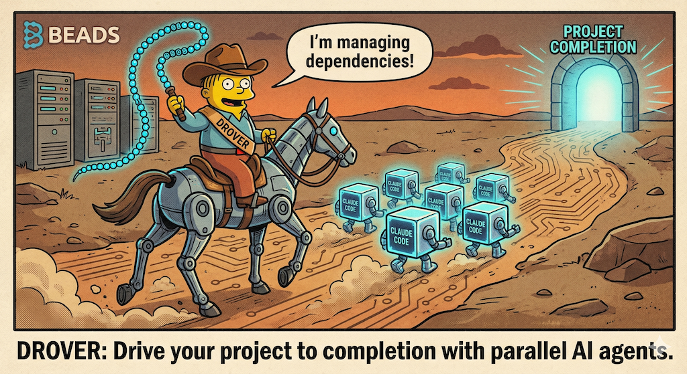

# 🐂 Drover

**Drive your project to completion with parallel AI agents.**



Drover is a durable workflow orchestrator that runs multiple AI coding agents in parallel to complete your entire project. It manages task dependencies, handles failures gracefully, and guarantees progress through crashes and restarts.

> *"No task left behind."*

## Workflow Engine
Drover uses **DBOS v0.14.0 (Durable Operating System for Workflows)** as its primary workflow engine:

- **Development**: SQLite-based orchestration (zero setup, works out of the box)
- **Production**: DBOS with PostgreSQL (set `DBOS_SYSTEM_DATABASE_URL`)

Both modes provide durable execution, automatic retries, and crash recovery.

## Why Drover?

You have a project with dozens of tasks. Running them one at a time is slow. Running them manually in parallel is chaotic. Drover solves this by:

- **Parallel execution** — Run 4, 8, or 16 AI coding agents simultaneously
- **Durable workflows** — Survive crashes, restarts, and network failures
- **Smart scheduling** — Respects task dependencies, priorities, and blockers
- **Isolated workspaces** — Each agent works in its own git worktree
- **Automatic retries** — Failed tasks retry with exponential backoff
- **Progress tracking** — Real-time status and completion estimates

## Quick Start

```bash
# Install (note: use the full package path including /cmd/drover)
go install github.com/cloud-shuttle/drover/cmd/drover@latest

# Add Go's bin directory to your PATH if not already configured
export PATH=$PATH:$HOME/go/bin

# Initialize in your project
cd my-project
drover init

# Create an epic and tasks
drover epic add "MVP Features"
drover add "Set up database schema" --epic epic-a1b2
drover add "Implement user authentication" --epic epic-a1b2
drover add "Build REST API" --epic epic-a1b2 --blocked-by task-x1y2
drover add "Add unit tests" --epic epic-a1b2 --blocked-by task-x1y2,task-z3w4

# Run everything to completion
drover run --workers 4

# Or run a specific epic
drover run --epic epic-a1b2
```

## Installation

### Prerequisites

- Go 1.22+ (currently targets Go 1.25)
- Git
- An AI coding agent installed and authenticated (Claude Code, Codex, Amp, OpenCode, or Drover Code)
- PostgreSQL (production) or SQLite (local dev, default)

### From Source

```bash
git clone https://github.com/cloud-shuttle/drover
cd drover
go build -o drover ./cmd/drover
```

### With Go Install

```bash
go install github.com/cloud-shuttle/drover/cmd/drover@latest
```

## Commands

| Command | Description |
|---------|-------------|
| `drover init` | Initialize Drover in current project |
| `drover run` | Execute all tasks to completion |
| `drover run --workers 8` | Run with 8 parallel agents |
| `drover run --epic <id>` | Run only tasks in specific epic |
| `drover add <title>` | Add a new task |
| `drover add <title> --parent <id>` | Add a sub-task to parent |
| `drover add "task-123.N title"` | Add sub-task with hierarchical syntax |
| `drover epic add <title>` | Create a new epic |
| `drover status` | Show current project status |
| `drover status --watch` | Live progress updates |
| `drover status --tree` | Show hierarchical task tree |
| `drover reset` | Reset all tasks back to ready |
| `drover reset task-abc task-def` | Reset specific tasks by ID |
| `drover reset --failed` | Reset all failed tasks |
| `drover resume` | Resume interrupted workflows |
| `drover worktree prune` | Clean up completed task worktrees |
| `drover worktree prune -a` | Clean up all worktrees (incl. build artifacts) |
| `drover import <file>` | Import tasks from a `.drover` export file |
| `drover import-jsonl <file.jsonl>` | Import tasks from JSON Lines format |
| `drover export [--format json]` | Export tasks to portable format |

### Bulk Task Creation

For importing multiple tasks at once, Drover provides several options:

#### 1. JSONL Import (Native CLI)

Use `drover import-jsonl` to import epics, stories, and tasks from JSON Lines format:

```bash
drover import-jsonl tasks.jsonl
```

JSONL format (one JSON object per line):
```jsonl
{"id": "EPIC-001", "type": "epic", "title": "Project Foundation", "description": "Set up infrastructure"}
{"id": "STORY-001", "type": "story", "epic_id": "EPIC-001", "title": "Initialize Rust Workspace", "description": "Create workspace", "priority": 10}
{"id": "TASK-001", "type": "task", "story_id": "STORY-001", "title": "Create cargo structure", "description": "Set up Cargo.toml", "priority": 5}
```

See `examples/gather-project.jsonl` for a complete example.

**Priority values:**
- Integer: 1-10 (higher = more urgent)
- String: "critical" (10), "high" (7), "normal" (5), "low" (2)

#### 2. AI-Powered Task Generation

Use `drover spec` to generate epics and tasks from design specifications:

```bash
# Generate from a spec file
drover spec design/spec.md

# Generate from a folder of design docs
drover spec design/

# Preview without creating
drover spec spec.md --dry-run
```

#### 3. Session Import/Export

Export and import complete Drover sessions:

```bash
# Export current session
drover export session.jsonl

# Import on another machine
drover import session.jsonl
```

## Configuration

Drover uses sensible defaults but can be configured via environment variables or flags:

```bash
# Database (default: SQLite in .drover.db)
export DROVER_DATABASE_URL="postgresql://localhost/drover"

# Or use SQLite explicitly
export DROVER_DATABASE_URL="sqlite:///.drover.db"

# Agent selection (default: claude)
export DROVER_AGENT_TYPE="claude"  # Options: claude, codex, amp, opencode
export DROVER_AGENT_PATH="/path/to/agent"  # Optional: custom agent binary path
```

### Agent Types

Drover supports multiple AI coding agents through a pluggable interface:

| Agent | Type | Description |
|-------|------|-------------|
| **Claude Code** | `claude` | Anthropic's Claude Code CLI (default) |
| **Codex** | `codex` | OpenAI's Codex agent |
| **Amp** | `amp` | Amp AI agent |
| **OpenCode** | `opencode` | OpenCode CLI by Anomaly |
| **Drover Code** | `drover-code` | Cloud Shuttle's native TUI agent |

```bash
# Use Codex instead of Claude
export DROVER_AGENT_TYPE="codex"
drover run

# Use Amp with a custom binary path
export DROVER_AGENT_TYPE="amp"
export DROVER_AGENT_PATH="/usr/local/bin/amp"
drover run

# Use OpenCode
export DROVER_AGENT_TYPE="opencode"
export DROVER_AGENT_PATH="/usr/local/bin/opencode"
drover run
```

**Note:** The deprecated `DROVER_CLAUDE_PATH` environment variable still works for backwards compatibility.

### Observability

Drover includes built-in OpenTelemetry observability for production monitoring:

```bash
# Enable OpenTelemetry (disabled by default)
export DROVER_OTEL_ENABLED=true
export DROVER_OTEL_ENDPOINT=localhost:4317

# Run with observability
drover run
```

**What you get:**
- **Traces**: Distributed tracing for workflows, tasks, and agent execution
- **Metrics**: Task completion rates, duration histograms, error counts
- **Dashboards**: Grafana dashboards for real-time monitoring

**Quick Start (with Docker):**
```bash
# Start the observability stack
docker compose -f docker-compose.telemetry.yaml up -d

# Run Drover with telemetry
export DROVER_OTEL_ENABLED=true
drover run

# View dashboards
open http://localhost:3000  # admin/admin
```

See [Observability Guide](./scripts/telemetry/README.md) for details.

### Task Options

```bash
# Set priority (higher = more urgent)
drover add "Critical fix" --priority 10

# Define dependencies
drover add "Build API" --blocked-by task-abc,task-def

# Assign to epic
drover add "New feature" --epic epic-xyz
```

## Sub-Tasks

Drover supports **hierarchical sub-tasks** with Beads-style task IDs (e.g., `task-123.1`, `task-123.1.2`). This lets you break down complex work into manageable pieces.

### Creating Sub-Tasks

There are two ways to create sub-tasks:

#### 1. Using the `--parent` flag

```bash
# Create a parent task
drover add "Implement authentication"
# ✅ Created task task-1736123456789

# Add sub-tasks using --parent
drover add "Design schema" --parent task-1736123456789
# ✅ Created task task-1736123456789.1

drover add "Implement login" --parent task-1736123456789
# ✅ Created task task-1736123456789.2

drover add "Add OAuth" --parent task-1736123456789
# ✅ Created task task-1736123456789.3
```

#### 2. Using hierarchical ID syntax

```bash
# Specify sequence number directly in the title
drover add "task-1736123456789.5 Add JWT tokens"
# ✅ Created task task-1736123456789.5

drover add "task-1736123456789.10 Write tests"
# ✅ Created task task-1736123456789.10
```

### Viewing Sub-Tasks

Use the `--tree` flag for a hierarchical view:

```bash
drover status --tree
```

Output:
```
🐂 Drover Task Tree
════════════════════
⏳ task-1736123456789: Implement authentication
    └── ⏳ task-1736123456789.1: Design schema
    └── ⏳ task-1736123456789.2: Implement login
    └── ⏳ task-1736123456789.3: Add OAuth
    └── ⏳ task-1736123456789.5: Add JWT tokens
    └── ⏳ task-1736123456789.10: Write tests
```

### How Sub-Tasks Execute

When a parent task is claimed for execution:

1. **Sub-tasks execute first** — All sub-tasks run sequentially (in order)
2. **Parent executes last** — Only after all sub-tasks complete
3. **Failure propagates** — If any sub-task fails, the parent task fails

Sub-tasks are **never claimed independently** — they only run as part of their parent task's execution.

### Hierarchy Rules

- **Maximum depth**: 2 levels (Epic → Parent → Child)
- **Sequence numbers**: Auto-incremented when using `--parent`, user-specified when using syntax
- **ID format**: `parent-id.sequence` (e.g., `task-123.1`)

### Example: Breaking Down a Feature

```bash
# Create the main feature task
drover add "Build user settings page" --skip-validation

# Break it down into sub-tasks
drover add "Create settings UI component" --parent task-xyz
drover add "Add settings persistence" --parent task-xyz
drover add "Implement validation" --parent task-xyz
drover add "Add unit tests" --parent task-xyz

# View the hierarchy
drover status --tree

# Run - sub-tasks execute automatically when parent runs
drover run
```

## How It Works

### The Drover Loop

```
while project has incomplete tasks:
    1. Find all ready tasks (no unmet dependencies)
    2. Claim tasks up to worker limit
    3. Execute each task in isolated git worktree
    4. On success: commit, merge, unblock dependents
    5. On failure: retry or mark failed
    6. On blocked: create resolution task (optional)

    Sleep and repeat until complete
```

### Durability

Drover uses [DBOS](https://dbos.dev) for durable workflow execution. Every step is checkpointed to the database. If Drover crashes:

1. Restart with `drover resume`
2. DBOS automatically recovers all workflows from their last checkpoint
3. Partially completed tasks resume, not restart

### Task States

```
ready → claimed → in_progress → completed
                      ↓
                   blocked → (unblocked) → ready
                      ↓
                   failed (after max retries)
```

### Git Worktrees

Each worker operates in an isolated git worktree:

```
.drover/
└── worktrees/
    ├── task-a1b2/    # Worker 1
    ├── task-c3d4/    # Worker 2
    ├── task-e5f6/    # Worker 3
    └── task-g7h8/    # Worker 4
```

Changes are committed per-task and merged back to main upon completion.

## Examples

### Complete a Full Project

```bash
# You have a project with existing tasks
drover init
drover run

# Drover discovers all tasks, builds dependency graph,
# and drives everything to completion
```

### Parallel Feature Development

```bash
# Create an epic for a new feature
drover epic add "User Dashboard"

# Add independent tasks (can run in parallel)
drover add "Dashboard layout component" --epic epic-dash
drover add "Fetch user stats API" --epic epic-dash
drover add "User preferences storage" --epic epic-dash

# Add dependent tasks
drover add "Wire up dashboard to API" --epic epic-dash \
  --blocked-by task-layout,task-api

drover add "Add dashboard tests" --epic epic-dash \
  --blocked-by task-wire

# Run with high parallelism
drover run --workers 8 --epic epic-dash
```

### Resume After Interruption

```bash
# Running a long job...
drover run --workers 4
# ^C (interrupted) or crash

# Later, resume exactly where you left off
drover resume
# All workflows continue from last checkpoint
```

## Architecture

Drover is built on a pure Go stack:

| Component | Technology | Purpose |
|-----------|------------|---------|
| CLI | Cobra v1.10 | Command-line interface |
| Workflows | DBOS Go v0.14.0 | Durable execution |
| Database | PostgreSQL/SQLite | State persistence |
| Agent Interface | Pluggable | Support for Claude, Codex, Amp, OpenCode, Drover Code |
| AI Agents | Multi-agent | Task execution |
| Isolation | Git Worktrees | Parallel workspaces |
| Concurrency | Backpressure (AIMD) | Adaptive worker scaling |
| Observability | OpenTelemetry v1.43 | Traces & metrics |

**Documentation:**
- [Documentation Index](./docs/index.md) - Complete documentation hub
- [Design Docs](./design/DESIGN.md) - Detailed architecture documentation
- [Spec Directory](./spec/) - Feature specifications
- [Contributing](./CONTRIBUTING.md) - Contribution guidelines

## Comparison

| Feature | Drover | Manual Claude | Cursor Background |
|---------|--------|---------------|-------------------|
| Parallel agents | ✅ 1-16+ | ❌ 1 | ✅ Limited |
| Crash recovery | ✅ Full | ❌ None | ❌ None |
| Dependency graph | ✅ Yes | ❌ Manual | ❌ No |
| Auto-retry | ✅ Yes | ❌ No | ❌ No |
| Progress tracking | ✅ Real-time | ❌ Manual | ⚠️ Basic |
| Git isolation | ✅ Worktrees | ❌ No | ❌ No |

## Contributing

Contributions welcome! Please read [CONTRIBUTING.md](./CONTRIBUTING.md) first.

```bash
# Run tests
go test ./...

# Run with race detector
go test -race ./...
```

## License

MIT — see [LICENSE](./LICENSE)

## Acknowledgments

Drover stands on the shoulders of giants. We're grateful to:

- **[DBOS](https://dbos.dev/)** — The durable workflow engine that powers Drover's crash recovery and exactly-once execution. The [DBOS Go SDK v0.14.0](https://github.com/dbos-inc/dbos-transact-golang) makes durable workflows accessible in Go.

- **[Beads](https://github.com/beads-dev/beads)** — Inspired the hierarchical task ID format (`task-123.1`, `task-123.1.2`). Beads' approach to breaking down complex work into manageable pieces heavily influenced Drover's sub-task system.

- **[Geoffrey Huntley](https://github.com/gdhuntley)** — The "Ralph Wiggum" concept (using AI agents to handle repetitive, well-defined tasks) inspired Drover's core philosophy: let agents handle the routine work while humans provide direction.

- **[Anthropic](https://www.anthropic.com/)** — Claude Code is the AI agent that powers Drover's task execution. Thanks for building an incredible AI coding assistant.

- **[Cloud Shuttle](https://cloudshuttle.com.au)** — Built and maintains Drover.

---

Built by [Cloud Shuttle](https://cloudshuttle.com.au) 🚀

*Drover keeps your tasks moving until they reach their destination: done.*
