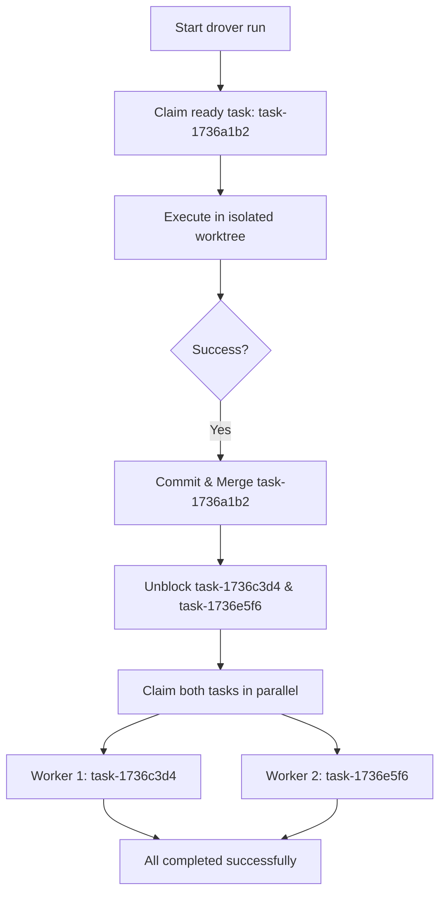

# First parallel epic tutorial

In this tutorial, you will learn how to use **Drover Orchestrator** to run multiple AI coding agents in parallel to complete a software project. We will set up a mock web application project, declare tasks with dependency constraints, inspect the backlog tree, and execute the run using two parallel worker agents.

By the end of this lesson, you will understand how Drover schedules tasks, manages Git worktree isolation, and resolves dependency constraints.

> [!NOTE]
> This tutorial runs in **local mode** using a SQLite database. No external database setup is required.

---

## Prerequisites

Before starting, ensure your machine has:
1. **Go 1.22+** installed and available in your `PATH`.
2. **Git** configured and installed.
3. An AI agent CLI installed (e.g., **Claude Code**). If you don't have one installed, Drover will execute in dry-run/mock mode for tasks, which is perfect for learning the scheduling behavior.

---

## Step 1: Install Drover

Install the Drover command-line interface directly from source:

```bash
go install github.com/cloud-shuttle/drover/cmd/drover@latest
```

Ensure your Go bin directory is in your `PATH`:

```bash
export PATH=$PATH:$HOME/go/bin
```

Verify the installation succeeded:

```bash
drover --help
```

---

## Step 2: Initialize a new project repo

Drover Orchestrator acts on a Git repository. Let's create a new folder, initialize a Git repository, and make an initial commit:

```bash
mkdir my-drover-webpage
cd my-drover-webpage
git init
git commit --allow-empty -m "Initial commit"
```

Next, initialize Drover in your project directory:

```bash
drover init
```

You should see the following output:
```
🐂 Initialized Drover in /path/to/my-drover-webpage/.drover
```

This creates a local database in `.drover/` to track your tasks, epics, and execution status.

---

## Step 3: Create an epic

In Drover, an **Epic** acts as a container for related tasks. Let's create an epic for our new landing page features:

```bash
drover epic add "Launch Landing Page"
```

Output:
```
✅ Created epic epic-4b7f: Launch Landing Page
```

> [!IMPORTANT]
> Note the generated epic ID (e.g., `epic-4b7f`). You will use your epic ID in the next steps to assign tasks to it.

---

## Step 4: Add tasks with blocker dependencies

Now we will build a dependency graph. We have three tasks:
1. Create the main HTML file (`index.html`).
2. Add styling (`styles.css`), which **depends on** the HTML file existing first.
3. Add interactivity (`app.js`), which also **depends on** the HTML file existing first.

Let's add Task 1 (the base page structure):

```bash
drover add "Create index.html layout" --epic epic-4b7f
```

Output:
```
✅ Created task task-1736a1b2
```

Now, let's add Task 2 and Task 3. Both are **blocked by** Task 1, which means they cannot execute until Task 1 successfully completes and merges.

Add the styling task:
```bash
drover add "Create styles.css page styles" --epic epic-4b7f --blocked-by task-1736a1b2
```

Output:
```
✅ Created task task-1736c3d4
```

Add the scripting task:
```bash
drover add "Create app.js interactivity" --epic epic-4b7f --blocked-by task-1736a1b2
```

Output:
```
✅ Created task task-1736e5f6
```

---

## Step 5: View the dependency tree

Let's inspect our project backlog to verify the dependency structure. Run the `status` command with the `--tree` flag:

```bash
drover status --tree
```

Drover displays your tasks in a hierarchical tree reflecting their current execution states and blocker blocks:

```
🐂 Drover Task Tree
════════════════════
⏳ task-1736a1b2: Create index.html layout
    └── 🚫 task-1736c3d4: Create styles.css page styles
    └── 🚫 task-1736e5f6: Create app.js interactivity
```

Notice the status icons:
* `⏳` (Ready) means `task-1736a1b2` has no unmet dependencies and is ready for execution.
* `🚫` (Blocked) means `task-1736c3d4` and `task-1736e5f6` are currently blocked by `task-1736a1b2`.

---

## Step 6: Run the epic in parallel

We will now trigger the orchestrator. We will configure Drover to use 2 parallel workers.

```bash
export DROVER_AGENT_TYPE="claude"
drover run --workers 2 --epic epic-4b7f
```

### What happens behind the scenes?

Here is how Drover executes the workflow:



1. **Step-One (Sequential Gate)**:
   The orchestrator starts. It queries the backlog for ready tasks. Only `task-1736a1b2` is ready. The orchestrator claims this task and provisions an isolated Git worktree inside `.drover/worktrees/task-1736a1b2/`. An AI agent is spawned in that worktree to complete the task.

2. **Commit and Merge**:
   Once the AI agent completes the work successfully, Drover commits the changes inside the worktree, merges them into your main branch, and marks the task as **Completed**.

3. **Step-Two (Parallel Execution)**:
   The orchestrator queries the backlog again. Now that `task-1736a1b2` is completed, the blocker constraint is satisfied. Both `task-1736c3d4` and `task-1736e5f6` transition to **Ready** status.

4. **Parallel Fan-out**:
   Since we specified `--workers 2`, Drover spawns two parallel worker loops. Worker 1 claims `task-1736c3d4` and Worker 2 claims `task-1736e5f6` simultaneously. Each executes in its own isolated worktree (`.drover/worktrees/task-1736c3d4/` and `.drover/worktrees/task-1736e5f6/`).

5. **Final Aggregation**:
   Each worker commits and merges back into the main branch sequentially. Once both tasks complete, the entire epic is finished.

---

## Step 7: Verify and clean up

Verify the final status of your project:

```bash
drover status
```

Output:
```
🐂 Drover Status
════════════════

Total:      3
Ready:      0
In Progress: 0
Paused:     0
Completed:  3
Failed:     0
Blocked:    0

Progress: 100.0%
[████████████████████████████████████████] 100.0%
```

Check your Git log to see the automated, sequential merges made by Drover:

```bash
git log --oneline
```

To free up local disk space consumed by the temporary task worktrees, run the prune command:

```bash
drover worktree prune --aggressive --force
```

This cleans up the `.drover/worktrees/` directory completely.

---

## Summary

Congratulations! You have completed your first parallel agent orchestration workflow with Drover:
1. Initialized a project with `drover init`.
2. Created a structured dependency chain using `--blocked-by`.
3. Observed how Drover enforces execution order and automatically fans out independent tasks in parallel using isolated Git worktrees.
